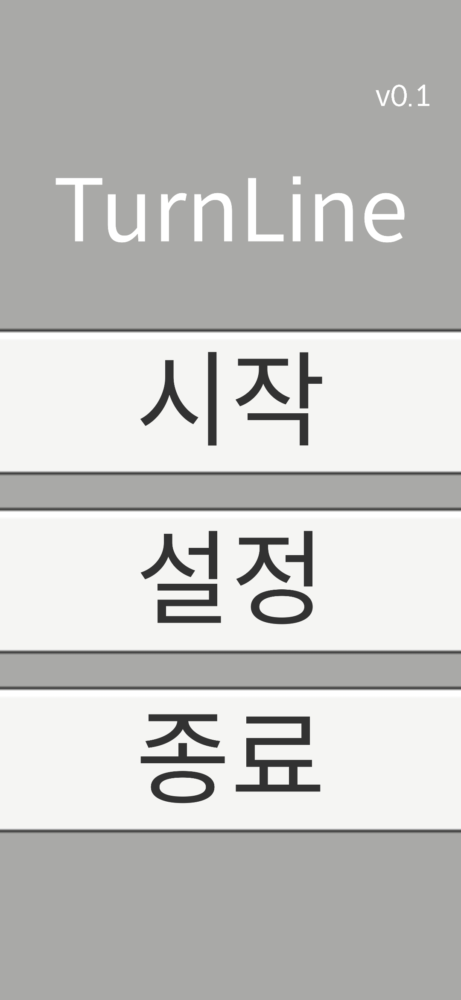
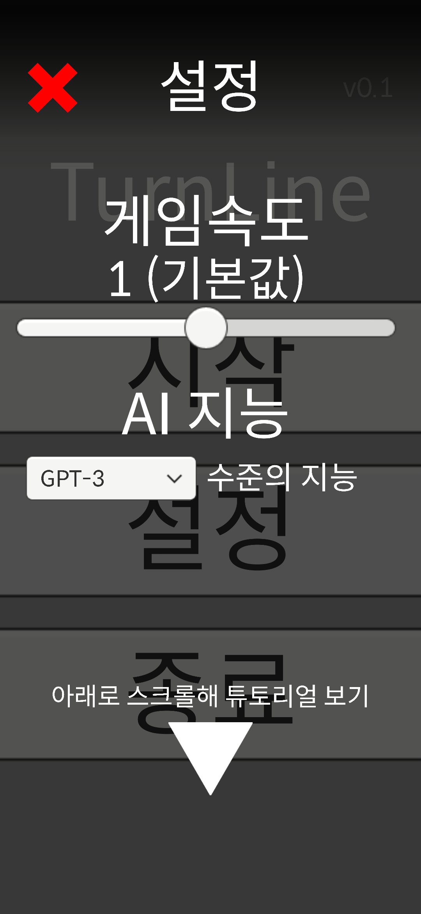
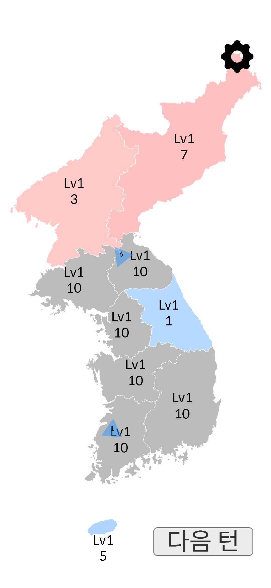
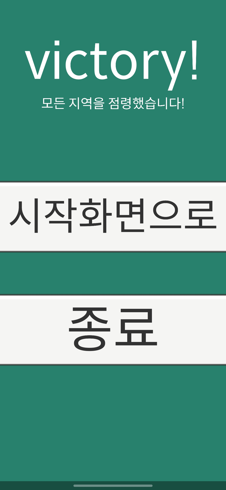

# 턴라인 (TurnLine)

미니멀 WEGO(동시 입력·동시 해석) 2인 점령 전략 게임. 매 턴 서로 명령을 예약하고, 고정된 해석 순서(업그레이드 → 방어태세 적용 → 이동·전투 → 생산 → 승리판정)로 결과가 결정됩니다. 방어 해제한 그 턴엔 피해 경감이 적용되지 않아 타이밍 심리전이 핵심입니다.

---

## 핵심 특징
- 동시해석 턴제(WEGO)로 깔끔한 리스크 계산
- **방어태세**: 레벨 비례 피해 경감, 해제 턴엔 미적용
- **중립지 동시도착**: 공격자끼리 상호차감 후 잔여 vs 중립
- **업그레이드·생산**: 레벨별 비용/생산량, 스노우볼과 템포를 함께 설계
- **직관적 UI**: 이동 슬라이더, 방어/해제 토글, 타깃 선택 모드
- **간결한 승리조건**: 모든 지역 점령 시 즉시 승리

---

## 규칙 요약
1) **업그레이드** 확정(비용 차감).  
2) **방어태세** 적용/해제(해제한 턴엔 경감 미적용).  
3) **이동·전투**  
   - 목적지별·진영별 도착 병력 합산  
   - 중립지: 공격자끼리 상호차감 → 잔여 vs 중립  
   - 소유지: 방어 경감률 `r = base + step × level`(상한 cap)로 유효공격력 계산  
4) **생산**: 소유 지역이 레벨당 병력 생산  
5) **승리판정**: 전 지역 소유 시 승리(또는 전멸 시 패배)

---

## 조작
- 지역 클릭 → **명령 패널**에서 이동/방어(진입·해제)/업그 선택
- 이동은 **슬라이더**로 병력 수 지정 후 **타깃 클릭**
- **턴 종료** 버튼으로 해석 실행(스킵과 동일 결과)

---

## AI
허브 선정 → 보강/집결 → 공격을 수행하며, 목표 필요 병력을 방어 경감까지 반영해 추정합니다. 방어 해제/유지 타이밍도 고려합니다.

---

- - **엔진**: Unity 6  
- **패키지**: DOTween, TextMeshPro  
- **씬 설정**: `GameController` 인스펙터에서 `ClearSceneName` / `DefeatSceneName` 지정  
- **밸런스**: 업그 비용/생산/방어 경감(기본·스텝·상한) 인스펙터 조정

---

## 플레이 팁
- **방어 해제 턴은 취약**합니다. 상대의 해제 타이밍에 도착하도록 전송을 조율하세요.  
- 같은 턴 같은 목적지 도착 아군 전송은 **합산 1회 전투**로 처리됩니다.

---

## 인게임 화면

  

  

  

  

---